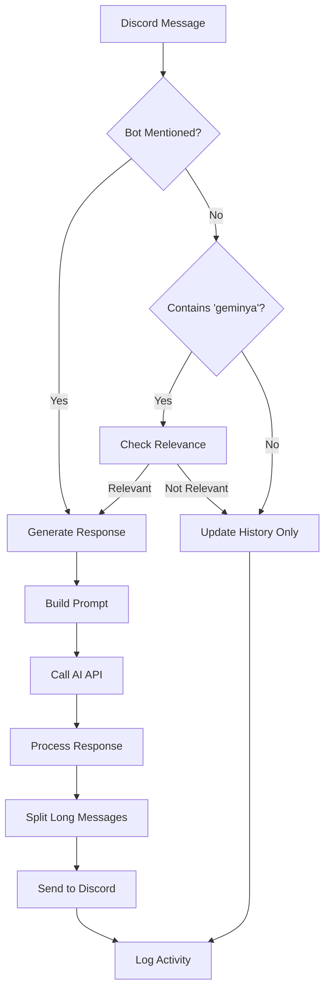

# Architecture Documentation

## System Overview

Geminya is a Discord bot built using the discord.py library that integrates with AI language models through the OpenRouter API. The bot embodies a catgirl personality with chaotic, playful characteristics and responds to user messages with context-aware AI-generated responses.

## High-Level Architecture

```
┌─────────────────┐    ┌─────────────────┐    ┌─────────────────┐
│   Discord API   │◄──►│   Geminya Bot   │◄──►│  OpenRouter API │
└─────────────────┘    └─────────────────┘    └─────────────────┘
                              │
                              ▼
                       ┌─────────────────┐
                       │  Local Storage  │
                       │ (Memory/Files)  │
                       └─────────────────┘
```

## Core Components

### 1. Bot Core (`base.py`)

The main entry point and bot instance management.

**Responsibilities:**

- Discord client initialization and configuration
- Cog loading and management
- Global bot state (model preferences, history)
- Command tree synchronization

**Key Classes:**

```python
class GeminyaBot(commands.Bot):
    - model: Dict[str, str]  # Server ID -> Model mapping
    - history: Dict[int, List[Dict]]  # Channel ID -> Message history
    - lore_book: Dict  # Trigger-based response system
```

### 2. Command System (`cogs/commands/`)

Modular command handlers using Discord.py's cog system.

**Architecture Pattern:**

```
commands/
├── __init__.py          # Auto-discovery module
├── change_model.py      # Model selection interface
├── help.py             # Dynamic help generation
└── nekogif.py          # External API integration
```

**Command Flow:**

```
User Input → Discord API → Bot → Command Cog → Response → Discord API → User
```

### 3. Event System (`cogs/events/`)

Asynchronous event handlers for Discord events.

**Event Flow:**

```
Discord Event → Event Cog → Processing Logic → Side Effects
                    │
                    ├── Message History Update
                    ├── AI Response Generation
                    └── Logging/Monitoring
```

**Key Events:**

- `on_message`: Core conversation processing
- `on_ready`: Bot initialization and setup
- `on_command_error`: Error handling and user feedback

### 4. AI Integration Layer (`utils/ai_utils.py`)

Manages communication with AI language models via OpenRouter.

**Response Generation Pipeline:**

```
User Message → Context Building → Prompt Construction → AI API Call → Response Processing → Discord Output
     │              │                    │                  │              │
     ▼              ▼                    ▼                  ▼              ▼
 Message Text   History +           Personality +      OpenRouter      Response
   Analysis     Lore Book          User Context         API Call       Formatting
```

**Key Functions:**

- `get_response()`: Main AI response generation
- `build_prompt()`: Context-aware prompt construction
- `get_check_response()`: Response relevance checking

### 5. Configuration System

Multi-layer configuration management for flexibility and security.

**Configuration Hierarchy:**

```
secrets.json (API Keys) → constants.py (App Config) → config.yml (User Config) → lang/en.json (Personality)
```

## Data Flow Architecture

### Message Processing Flow



### State Management

**Memory-Based State:**

- **Conversation History**: Per-channel message history with configurable length
- **Model Preferences**: Per-server AI model selection
- **Lore Book**: Trigger-based response templates loaded at startup

**Persistent State:**

- **Configuration Files**: YAML and JSON configuration
- **Logs**: File-based logging for debugging and monitoring

## Component Interactions

### Cog System Architecture

```
GeminyaBot Instance
├── Command Cogs (Slash Commands)
│   ├── change_model.py
│   ├── help.py
│   └── nekogif.py
└── Event Cogs (Discord Events)
    ├── on_message.py
    ├── on_ready.py
    └── on_command_error.py
```

**Auto-Discovery Pattern:**

```python
# commands/__init__.py
COMMANDS = [module.name for module in iter_modules(__path__, f"{__package__}.")]

# events/__init__.py
EVENT_HANDLERS = [module.name for module in iter_modules(__path__, f"{__package__}.")]
```

### AI Response Generation Architecture

**Layered Prompt Construction:**

```
Final Prompt = Base Personality + Conversation History + Lore Book Context + Current Message
```

**Context Management:**

- **Sliding Window**: Fixed-size conversation history per channel
- **Lore Book Integration**: Keyword-triggered contextual responses
- **Personality Consistency**: System prompt ensures character consistency

## Scalability Considerations

### Current Limitations

1. **Memory Usage**: All state stored in RAM (no persistence)
2. **Single Instance**: No horizontal scaling support
3. **Rate Limiting**: Basic rate limiting for AI API calls

### Scaling Strategies

**Vertical Scaling:**

- Increase memory for larger history buffers
- Faster CPU for concurrent request processing
- SSD storage for faster log writing

**Horizontal Scaling (Future):**

- Database backend for state persistence
- Redis for distributed caching
- Load balancer for multiple bot instances

## Security Architecture

### API Security

**Token Management:**

- Discord bot token stored in `secrets.json`
- OpenRouter API key separated from code
- No tokens in version control (`.gitignore`)

**Input Validation:**

- Discord.py handles message sanitization
- Length limits on AI responses
- Safe error handling for malformed inputs

### Data Privacy

**Memory Management:**

- Conversation history limited to recent messages
- No permanent storage of user messages
- Automatic cleanup of old conversation data

## Error Handling Strategy

### Graceful Degradation

```
AI API Failure → Fallback Message
Network Issues → Retry with Backoff
Invalid Commands → User-Friendly Error
```

### Error Recovery

**Automatic Recovery:**

- Exponential backoff for API rate limits
- Automatic reconnection for Discord disconnects
- Memory cleanup on high usage

**Manual Recovery:**

- Log file analysis for debugging
- Bot restart for critical failures
- Configuration reload without restart

## Performance Characteristics

### Response Times

- **Command Processing**: < 100ms (local operations)
- **AI Response Generation**: 1-5 seconds (API dependent)
- **Message History Updates**: < 10ms (memory operations)

### Resource Usage

- **Memory**: ~50-100MB base + ~1KB per stored message
- **CPU**: Low usage, spikes during AI API calls
- **Network**: Primarily Discord WebSocket + periodic AI API calls

### Bottlenecks

1. **AI API Latency**: Primary response time factor
2. **Discord Rate Limits**: Command and message sending limits
3. **Memory Growth**: History accumulation over time

## Monitoring and Observability

### Logging Strategy

**Multi-Level Logging:**

```
DEBUG   → Development debugging
INFO    → Normal operations
WARNING → Recoverable issues
ERROR   → Serious problems
```

**Log Destinations:**

- Console output for real-time monitoring
- File logs for message processing (`logs/on_message.log`)
- Discord logging for bot events

### Health Monitoring

**Built-in Metrics:**

- Bot latency to Discord
- Number of connected guilds
- Active conversation channels
- AI API response times

## Future Architecture Improvements

### Planned Enhancements

1. **Database Integration**: PostgreSQL for persistent state
2. **Caching Layer**: Redis for response caching
3. **Metrics Collection**: Prometheus/Grafana monitoring
4. **Configuration API**: Hot-reload configuration changes
5. **Plugin System**: Dynamic command loading

### Architectural Evolution

**Phase 1**: Current file-based architecture
**Phase 2**: Database-backed with caching
**Phase 3**: Microservices with message queues
**Phase 4**: Distributed deployment with load balancing

This architecture provides a solid foundation for the current requirements while maintaining extensibility for future enhancements.
