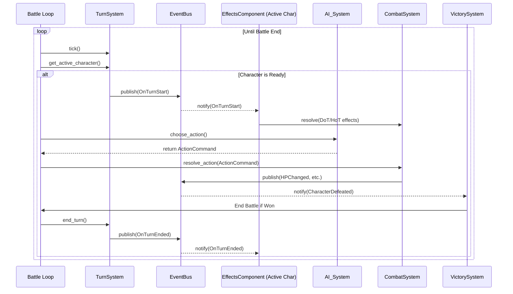

## **System Interaction Document: Anime Character Auto-Battler**

### **1.0 Document Purpose**

This document details the precise, sequential interactions between the core game systems during a standard battle loop. It serves as a practical guide for developers to understand how data flows and how different modules collaborate to execute the game's logic. It follows a single turn from the "tick" of the game clock to the final resolution of a character's action.

The primary systems involved in this loop are:
*   **The `Battle` Object:** The main process that orchestrates the loop.
*   **`TurnSystem`:** The timekeeper of the battle.
*   **`EventBus`:** The central messenger for all systems.
*   **`EffectsComponent`:** The manager for all status effects on a character.
*   **`AI_System`:** The decision-maker for character actions.
*   **`CombatSystem`:** The resolver of all actions and their consequences.
*   **`VictorySystem`:** The arbiter of the battle's end.

---

### **2.0 The Core Battle Loop: A Step-by-Step Flow**

The battle progresses in a continuous loop, orchestrated by the main `Battle` object. This loop persists until the `VictorySystem` signals that a win, loss, or draw condition has been met.

#### **Phase 1: Time Progression (The "Tick")**

1.  **Caller:** `Battle` object's main loop.
2.  **Target System:** `TurnSystem`.
3.  **Action:** The `Battle` object calls `TurnSystem.tick()`.
4.  **Process:**
    *   The `TurnSystem` iterates through every `Character` currently active in the `BattleContext`.
    *   For each character, it queries their **`StatsComponent`** to get their final, modified `spd` stat.
    *   It adds this `spd` value to the `action_gauge` property within the character's **`StateComponent`**.
    *   The `TurnSystem` then checks if a full "round-equivalent" has passed (as defined in GDD 7.0). If so, it publishes an **`OnRoundEnded`** event to the `EventBus`.

#### **Phase 2: Turn Readiness and Initiation**

1.  **Caller:** `Battle` object's main loop.
2.  **Target System:** `TurnSystem`.
3.  **Action:** The `Battle` object calls `TurnSystem.get_active_character()`.
4.  **Process:**
    *   The `TurnSystem` scans all characters in the `BattleContext`.
    *   It identifies the character with the highest `action_gauge` that is at or above 1000. This becomes the `active_character`.
    *   If no character is ready, it returns `null`, and the loop proceeds to the next tick.
    *   If a character is ready, the `TurnSystem` publishes an **`OnTurnStart`** event to the `EventBus`, with the `active_character` as the payload.

#### **Phase 3: Turn Start Effects**

1.  **Caller:** `EventBus`.
2.  **Target System:** The `active_character`'s **`EffectsComponent`**.
3.  **Action:** The `EventBus` notifies all subscribers of the `OnTurnStart` event. The `EffectsComponent` of the `active_character` receives this notification.
4.  **Process:**
    *   The `EffectsComponent` iterates through its list of active `Effect` objects.
    *   For each effect, it checks if its trigger hook is `OnTurnStart`.
    *   If it matches, it executes the effect's logic:
        *   **For DoTs/HoTs (Bleed, Regen):** It creates a new, simplified `ActionCommand` (e.g., `{caster: self, skill: "BleedDamage", targets: [self]}`) and passes it to the `CombatSystem` for immediate resolution.
        *   **Duration Countdown:** It decrements the `duration` counter of all effects. If an effect's duration reaches zero, it is removed, and an **`OnEffectExpired`** event is published.

#### **Phase 4: AI Decision Making**

1.  **Caller:** `Battle` object's main loop.
2.  **Target System:** `AI_System`.
3.  **Action:** The `Battle` object calls `AI_System.choose_action(active_character)`.
4.  **Process:**
    *   The `AI_System` first queries the `active_character`'s **`StateComponent`** to check for a "Primed" Signature Skill. If one exists, it immediately returns that as the `ActionCommand`.
    *   If not primed, it queries the `BattleContext` to get a complete, read-only snapshot of the entire battlefield state (all character stats, positions, effects, etc.).
    *   It executes its **Three-Phase Selection Logic** using this data, ultimately producing a final `ActionCommand` object containing the caster, the chosen skill, and the selected target(s).

#### **Phase 5: Action Resolution**

1.  **Caller:** `Battle` object's main loop.
2.  **Target System:** `CombatSystem`.
3.  **Action:** The `Battle` object passes the `ActionCommand` from the AI to `CombatSystem.resolve_action(action)`.
4.  **Process (Example: Damage Skill):**
    *   **a. Pre-Action Hook:** The `CombatSystem` publishes a **`PreProcess_Action`** event. This is the last chance for an effect (like "Stun") to intercept and cancel the entire action.
    *   **b. Pre-Calculation Hook:** The `CombatSystem` publishes a **`PreProcess_DamageCalculation`** event. This allows effects to temporarily modify the stats of the caster or target (e.g., Armor Break reducing target `vit`).
    *   **c. Calculation:** The `CombatSystem` fetches the final, modified stats from the respective `StatsComponents` and calculates the damage according to the GDD formulas.
    *   **d. Post-Calculation Hook:** The `CombatSystem` publishes a **`PostProcess_DamageCalculation`** event. This allows effects to modify the final numeric value (e.g., applying critical damage, shield absorption).
    *   **e. State Change:** The final damage value is applied to the target's HP in their `StateComponent`.
    *   **f. Event Publishing:** The `CombatSystem` publishes several events to announce the results:
        *   **`HPChanged`**: Notifies the system that a character's health has been modified.
        *   **`EffectApplied`**: If the skill applied a new status effect (e.g., a debuff).
        *   **`AttackDodged`** or **`CriticalHit`**: If these specific outcomes occurred.

#### **Phase 6: Post-Action and Victory Check**

1.  **Caller:** The `EventBus` (reacting to events from Phase 5).
2.  **Target Systems:** Various `EffectsComponents`, `VictorySystem`.
3.  **Action:** The events published by the `CombatSystem` trigger reactive logic.
4.  **Process:**
    *   An `HPChanged` event might trigger an effect on another character (e.g., Megumin's Explosion).
    *   If a `CharacterDefeated` event was published, the `VictorySystem` catches it and immediately checks if all characters on one team are defeated. If so, it sets the `BattleContext`'s state to "Finished" and publishes a **`BattleCompleted`** event.
    *   The `Battle` object's main loop sees the "Finished" state and terminates.

#### **Phase 7: Turn Cleanup**

1.  **Caller:** `Battle` object's main loop (if the battle is not finished).
2.  **Target System:** `TurnSystem`.
3.  **Action:** The `Battle` object calls `TurnSystem.end_turn(active_character)`.
4.  **Process:**
    *   The `TurnSystem` resets the `action_gauge` of the `active_character` in their `StateComponent`.
    *   The `TurnSystem` publishes an **`OnTurnEnded`** event to the `EventBus`.
    *   The `active_character`'s `EffectsComponent` catches this event and removes any temporary effects that were set to expire at the end of their turn (e.g., from Guard Stance).
    *   The loop then returns to Phase 1 to begin the next tick.

---

### **3.0 System Interaction Diagram**

